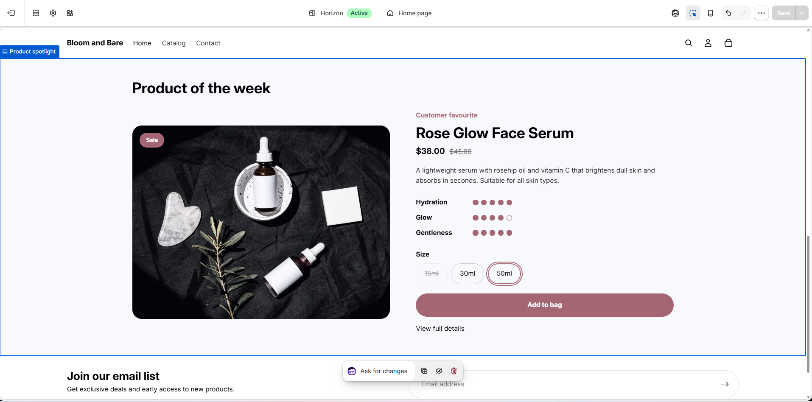
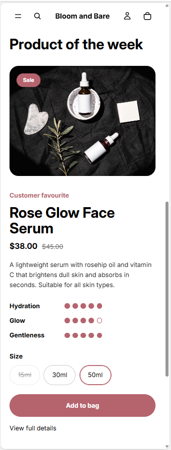
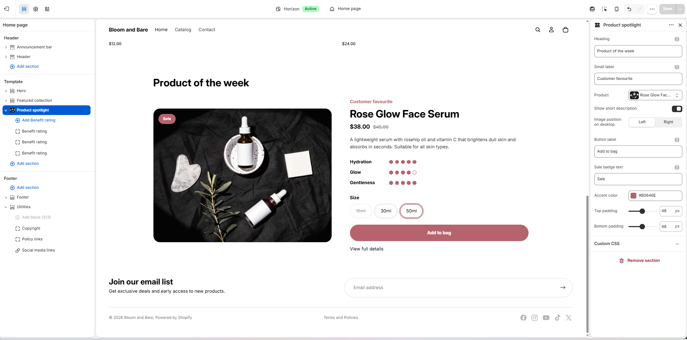
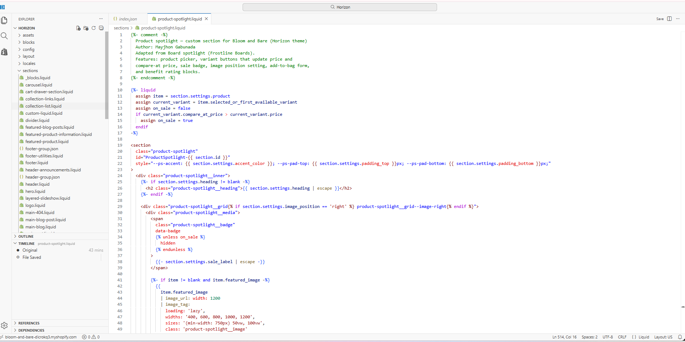

# Shopify Custom Sections

Two custom Online Store 2.0 sections written in Liquid, each built for a different Shopify Partner development store. The second section is adapted from the first for a different niche, with new features added.

| Section | Store | Theme | Niche |
|---|---|---|---|
| [Board spotlight](#1-board-spotlight--frostline-boards) | Frostline Boards | Dawn-based OS 2.0 theme | Snowboards |
| [Product spotlight](#2-product-spotlight--bloom-and-bare) | Bloom and Bare | Horizon | Skincare and beauty |

Password-protected live previews of both stores are available on request.

---

## 1. Board spotlight — Frostline Boards

File: [`board-spotlight.liquid`](board-spotlight.liquid)

Features one snowboard on the homepage with a size selector, live price updates, a sold-out state, and spec ratings the merchant edits in the theme editor.

**Features**

- Product picker so the merchant chooses which board to feature
- Variant buttons (board sizes) that update the price instantly
- Sold-out variants crossed out and disabled
- Add to cart form using Shopify's native `` tag
- Spec rating blocks (Flex, Park, Powder) with a 1–5 rating shown as bars
- Settings for heading, label, button text, accent color, and padding
- Responsive: two columns on desktop, stacked on mobile

| Mobile | Settings |
|---|---|
|  |  |

---

## 2. Product spotlight — Bloom and Bare

File: [`product-spotlight.liquid`](product-spotlight.liquid)

Adapted from Board spotlight for a skincare store on Shopify's Horizon theme, with sale pricing and more layout control.

**New in this version**

- **Sale badge and compare-at price** that appear only when the selected variant is on sale, and update when the shopper switches sizes
- **Image position setting** (left or right on desktop)
- **Benefit rating blocks** (Hydration, Glow, Gentleness) shown as dots
- Rounded, softer styling and "Add to bag" wording to suit a beauty brand
- Section-scoped Custom CSS used to tune the heading size within Horizon

| Mobile | Settings |
|---|---|
|  |  |

---

## Shared technical details

- Scoped JavaScript per section instance, re-initialized on `shopify:section:load` so it keeps working in the theme editor
- Accessibility: `aria-pressed` on variant buttons, screen-reader text for ratings, visible keyboard focus
- Styles in ``, with merchant settings passed in through CSS custom properties
- Schema presets so each section appears ready to use under **Add section**

## How to install

1. In Shopify admin, go to **Online Store → Themes**.
2. On your theme, click **⋯ → Edit code**.
3. In the `sections` folder, create a new file with the same name as the section file.
4. Paste in its contents and click **Save**.
5. Open **Customize**, click **Add section**, and choose **Board spotlight** or **Product spotlight**.
6. Pick a product and adjust the settings and rating blocks.

Works with Online Store 2.0 themes (themes using JSON templates).

## Built with

Liquid · HTML · CSS (custom properties, grid, flexbox) · Vanilla JavaScript

## Author

**Mayjhon Gabunada**
Full Stack Web Developer
[GitHub](https://github.com/mgabunad) · [Portfolio](https://mgabunad.github.io/portfolio)
