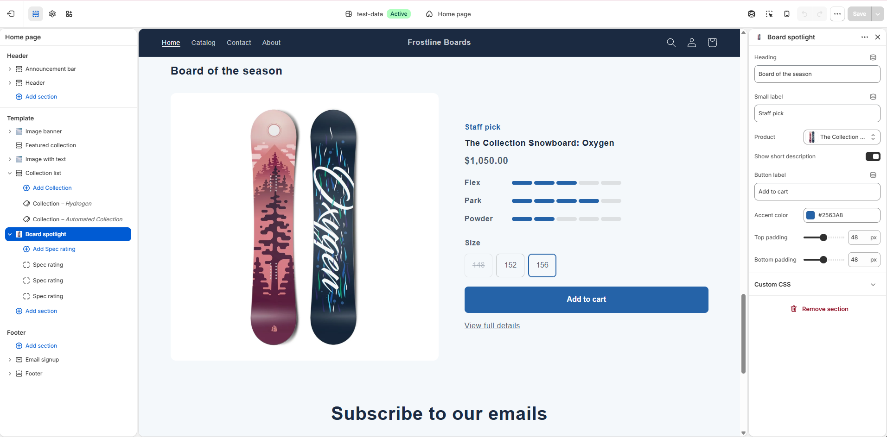
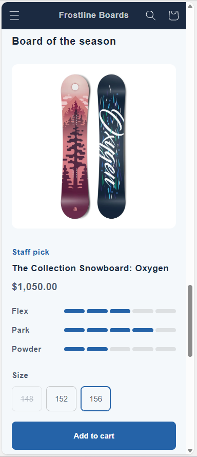
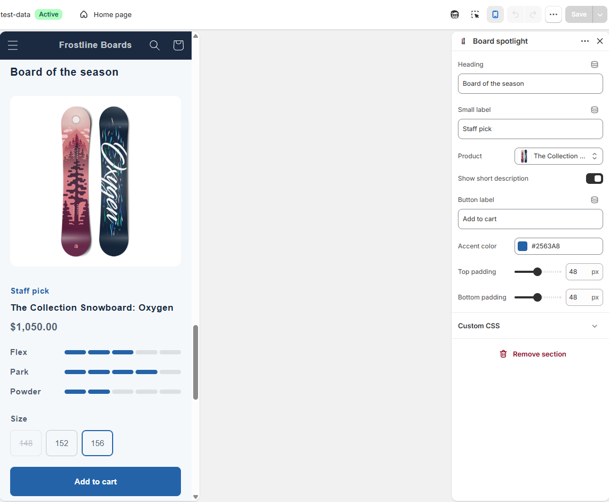
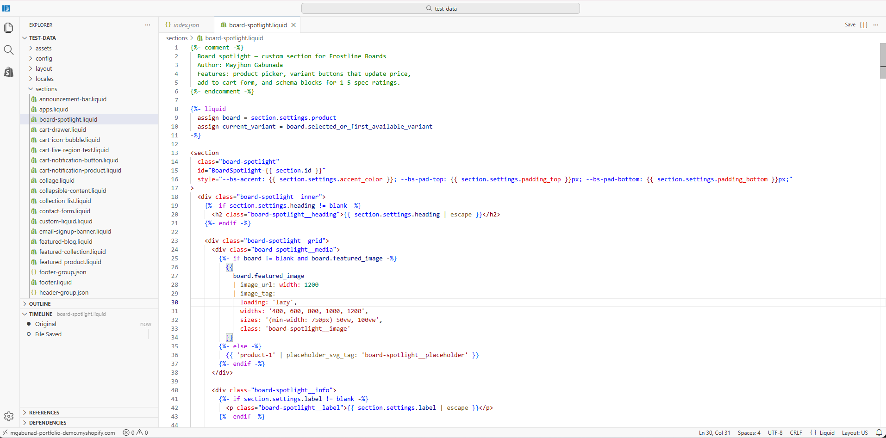
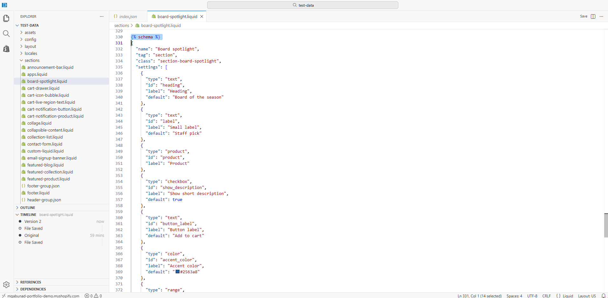

# Shopify Board Spotlight Section

A custom Online Store 2.0 section written in Liquid for **Frostline Boards**, a snowboard demo store on a Shopify Partner development store.

It features one product on the homepage with a size selector, live price updates, a sold-out state, and spec ratings the merchant can edit in the theme editor without touching code.

## Features

- **Product picker** so the merchant chooses which board to feature
- **Variant buttons** (for example, board sizes) that update the price instantly when clicked
- **Sold-out handling**: unavailable variants are crossed out and disabled
- **Add to cart form** using Shopify's native `` tag
- **Spec rating blocks** (Flex, Park, Powder, and so on) with a 1–5 rating, up to 6 blocks
- **Merchant settings** for heading, label, button text, accent color, and top/bottom padding
- **Responsive layout**: two columns on desktop, stacked on mobile
- **Accessible**: `aria-pressed` on variant buttons, screen-reader text for ratings, visible keyboard focus
- **Theme editor support**: JavaScript re-initializes on `shopify:section:load`

## Screenshots

| Mobile | Settings |
|---|---|
|  |  |

### Code

## How to install

1. In Shopify admin, go to **Online Store → Themes**.
2. On your theme, click **⋯ → Edit code**.
3. In the `sections` folder, create a new file named `board-spotlight.liquid`.
4. Paste in the contents of [`board-spotlight.liquid`](board-spotlight.liquid) and click **Save**.
5. Open **Customize**, click **Add section**, and choose **Board spotlight**.
6. Pick a product and adjust the settings and spec blocks.

Works with Online Store 2.0 themes (themes using JSON templates).

## Built with

- Liquid (Shopify templating)
- HTML, CSS (custom properties, grid, flexbox)
- Vanilla JavaScript

## Notes

This was built and tested on a Shopify Partner development store with sample products. A password-protected live preview is available on request.

## Author

**Mayjhon Gabunada**
Full Stack Web Developer
[GitHub](https://github.com/mgabunad) · [Portfolio](https://mgabunad.github.io/portfolio)
